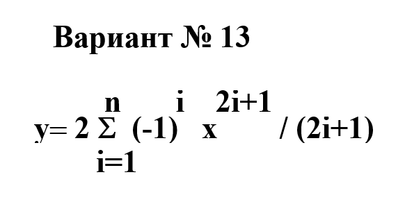

# Data-Science-in-Economics
Выполнение заданий по предмету «Современные методы программирования»

## Задача 2: Поиск элементов в последовательностях

### Ввод
Значение x,  метод вычисления (1 - фиксированное количество членов, 2 - до достижения заданной точности), количество членов ряда

### Задача
Написать программу на языке Python, которая буден вычислять значение ряда из индивидуального варианта. Там где это возможно, избегать лишних вычислений(замена возведения в степень на умножение в каждом шаге и тд.)
Реализовать 2 версии программы. Первая считает фиксированное количество членов ряда, а вторая работает до тех пор, пока слагаемое не станет меньше eps.

### Пример

## Задача 4: Поиск элементов в последовательностях

### Ввод
Вводятся 2 последовательности целых чисел A и B.

### Задача
С помощью процедуры обеспечить поиск элементов, не входящих в одну из последовательностей или A, или B.

### Решение
1. Вывести исходные последовательности:
   - Последовательность A: [здесь вы вставляете последовательность A]
   - Последовательность B: [здесь вы вставляете последовательность B]
2. Выполнить процедуру поиска и вывести результаты:
   - Результат поиска элементов, не входящих в A: [здесь вы вставляете результат поиска для A]
   - Результат поиска элементов, не входящих в B: [здесь вы вставляете результат поиска для B]
